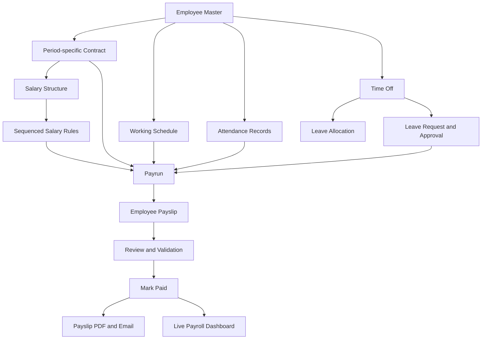
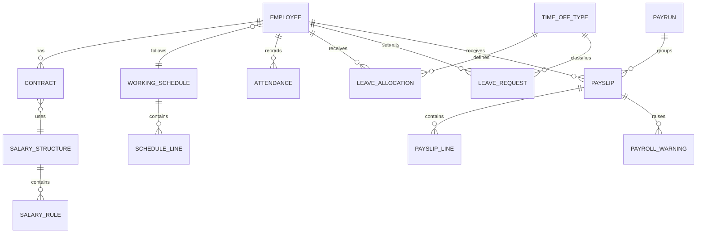

# PeoplePay360: HR & Payroll

> An integrated human-resource and payroll operations platform that connects employee records, contracts, work schedules, attendance, leave, salary rules, payruns, payslips, and reporting in one auditable workflow.

**Project status:** Hackathon project in development

## Overview

PeoplePay360 is designed to solve a common problem in growing organizations: employee, attendance, leave, contract, and payroll information often lives in disconnected tools or spreadsheets. These gaps create duplicate work, calculation errors, delayed payroll, weak audit trails, and employee confusion.

The platform treats the **Employee** record as the central hub. Contracts define the employment terms valid for a particular period; working schedules define expected hours; attendance and approved time off record what happened; salary structures and sequenced rules define how pay is calculated; and payruns transform those records into validated payslips.

The project follows the requirements of the PeoplePay360 problem statement provided for the Odoo Hackathon. Its focus is accurate business logic, connected data, role-based access, error prevention, and an end-to-end employee-to-payslip experience.

## Problem Statement

Many HR systems can store employee information, while separate tools track attendance, leave, and salary. Real payroll operations require all these records to work together.

PeoplePay360 addresses questions such as:

- Which employee contract was valid during the selected payroll period?
- What working schedule was assigned to the employee?
- Were all attendance entries complete and approved?
- Which leave requests were approved, and which ones affect salary?
- Which salary structure and rules should be applied?
- Are there duplicate payslips, missing bank details, or conflicting contracts?
- Can every number on the payslip be traced to its source?

## Project Goals

- Maintain a unified employee record with connected HR and payroll information.
- Preserve contract and salary history instead of overwriting past records.
- Track working schedules, attendance, attendance exceptions, and corrections.
- Manage time-off types, allocations, requests, approvals, and leave balances.
- Calculate salaries using configurable structures and sequenced salary rules.
- Process payroll through controlled payrun and payslip workflows.
- Detect payroll problems before validation and payment.
- Generate individual payslip PDFs and support bulk employee delivery.
- Provide live payroll, attendance, leave, and workforce reporting.
- Give employees a transparent and understandable payroll experience.

## Core Workflow



## User Roles and Permissions

| Role | Responsibilities and access |
| --- | --- |
| **Employee** | View personal employee details, attendance, leave balances, leave requests, and payslips. Create attendance records and time-off requests. No access to other employees or payroll administration. |
| **HR Manager** | Manage employees, contracts, schedules, attendance, time-off types, allocations, and requests. Approve or refuse leave. No payroll administration access. |
| **HR Payroll User** | Includes HR Manager capabilities and can create, update, compute, and process payruns and payslips. Salary structures and rules are read-only. |
| **HR Payroll Manager** | Full HR and payroll access, including salary structures, salary rules, payruns, payslips, and payroll configuration. |
| **Admin** | Full platform access, user management, role assignment, permission configuration, and system administration. |

## Functional Modules

### 1. Authentication and Access Control

- Secure user authentication.
- Role-based authorization on every protected operation.
- Employee accounts restricted to their own records.
- Separate HR and payroll permissions.
- Audit logging for sensitive changes and administrative actions.

### 2. Employee Master Management

The Employee record acts as the operational hub of the platform.

Supported views:

- Kanban view
- List view
- Employee form

Typical employee information:

- Employee ID, name, image, email, and phone
- Department, job position, and manager
- Employee type and employment status
- Date of joining
- Assigned working schedule
- Bank and payroll-related information

The Employee form provides direct access to related Contracts, Attendance, Time Off, Allocations, and Payslips.

### 3. Contract Management

Contracts preserve employment and salary history over time.

Each contract can include:

- Employee
- Start and end dates
- Department and job position
- Wage
- Working schedule
- Salary structure
- Contract status

For a selected payroll period, the system must use only the applicable contract. Overlapping active contracts are treated as a critical payroll conflict and must be corrected before payroll is finalized.

Suggested contract lifecycle:

```text
Draft -> Active -> Expired
               -> Cancelled
```

### 4. Working Schedule Management

A working schedule contains weekly schedule lines with:

- Day of the week
- Start time
- End time
- Break duration

The platform calculates daily and weekly working hours automatically:

```text
Daily hours  = End time - Start time - Break
Weekly hours = Sum of all configured daily hours
```

Schedules provide the expected-time context used to interpret attendance, absence, late arrival, early departure, and overtime.

### 5. Attendance Management

Attendance records capture:

- Employee
- Check-in time
- Check-out time
- Worked hours
- Attendance status
- Exception or correction information

The system should identify exceptions such as:

- Missing check-in or checkout
- Late arrival
- Early departure
- Absence
- Overtime
- Duplicate attendance
- Manual correction

Authorized corrections retain the original value, corrected value, responsible user, timestamp, and reason.

### 6. Time Off Management

Time Off consists of three connected areas.

#### Time-Off Types

Defines the leave policy, including:

- Unit in days or hours
- Whether allocation is required
- Approval workflow
- Paid or unpaid payroll treatment
- Active status

#### Leave Allocations

Grants an approved leave balance to an employee and tracks:

- Allocated amount
- Amount taken
- Remaining balance
- Validity period
- Approval status

#### Leave Requests

Employees request leave by selecting a type, dates, duration, and reason. Approved requests consume the available allocation where required.

Suggested request lifecycle:

```text
Draft -> Submitted -> Approved
                   -> Refused
```

The platform prevents requests with insufficient balance, invalid dates, overlapping approved leave, or missing required allocations.

### 7. Salary Structures

A Salary Structure is a configurable container for related salary rules.

Examples:

- Regular Employee
- Contract Worker
- Intern
- Management

The applicable employee contract determines which salary structure is used during payroll computation.

### 8. Salary Rules

Salary rules calculate earnings, allowances, contributions, deductions, gross salary, and net salary.

Each rule contains:

- Name and unique code
- Category
- Sequence
- Calculation method
- Fixed amount, percentage, or formula
- Active status
- Payslip visibility

Rules execute in sequence so that later rules can use the results of earlier rules.

Example:

| Sequence | Rule | Example calculation |
| ---: | --- | --- |
| 10 | Basic | Contract wage |
| 20 | House Rent Allowance | 40% of Basic |
| 30 | Other Allowance | Fixed amount |
| 40 | Gross | Basic + Allowances |
| 50 | Unpaid Leave | Deduction based on unpaid days |
| 60 | Other Deductions | Configured deduction rules |
| 100 | Net | Gross - Deductions |

Payroll results must be calculated from these rules rather than hardcoded values.

### 9. Two-Step Payrun Wizard

Creating a payrun uses a controlled two-step process.

#### Step 1: Define Scope

- Payrun name
- Salary structure
- Payroll period

#### Step 2: Select Employees

The system displays eligible employees based on active status, applicable contract, selected structure, and payroll period. Only explicitly selected employees are added to the new payrun.

### 10. Payrun Processing

A Payrun groups employee payslips for one payroll period.

Suggested lifecycle:

```text
Draft -> Computed -> Validated -> Paid
```

Main actions:

- **Compute:** Generate or update payslips from contracts, schedules, attendance, leave, and salary rules.
- **Validate:** Confirm that payroll data and calculated results have been reviewed.
- **Mark Paid:** Record payment status and preserve the finalized payroll history.
- **Send Payslips:** Generate payslip PDFs and distribute them to employees in bulk.

### 11. Payslips

Each payslip displays:

- Employee and contract
- Payrun and payroll period
- Salary structure
- Worked days
- Earnings and allowances
- Deductions
- Gross and net salary
- Status
- Detailed salary-rule lines

Payslips remain accessible from both the parent Payrun and the dedicated Payslips view.

### 12. Payroll Validation and Warnings

The platform should detect problems before payroll is finalized.

Critical or reviewable conditions include:

- No applicable contract
- Overlapping active contracts
- Duplicate payslip for the same employee and period
- Missing working schedule
- Missing bank information
- Missing employee email
- Missing attendance checkout
- Unapproved attendance correction
- Insufficient or negative leave balance
- Invalid salary-rule dependency or formula
- Negative net salary
- Unusually large salary change

Suggested warning levels:

- **Critical:** Blocks validation.
- **Warning:** Requires review or a documented override.
- **Information:** Provides useful context without blocking payroll.

### 13. Payslip PDF and Delivery

The platform generates a printable PDF containing:

- Company and employee information
- Payroll period
- Earnings breakdown
- Deduction breakdown
- Gross and net salary
- Payment status
- Generation date

The Payrun supports bulk delivery of generated payslips to employee email addresses.

### 14. Payroll Dashboard

The dashboard aggregates live information from Employees, Contracts, Attendance, Time Off, Payruns, and Payslips.

Filters:

- Period
- Department
- Employee type

Key metrics:

- Total net salary paid
- Payslips generated
- Average salary
- Approved time off
- Attendance health

Charts and operational views:

- Salary cost by department
- Monthly net-salary trend
- Department headcount and salary expenditure
- Present, late, absent, and overtime counts
- Missing checkouts and manual attendance edits
- Approved and pending time off
- Payroll, contract, and employee-data warnings

Dashboard values must come from actual application records, not static demonstration values.

## PayTrust Live: Hackathon Innovation

PeoplePay360 includes an optional innovation layer called **PayTrust Live**. It improves payroll transparency and helps resolve mistakes before payment without replacing the required payroll workflow.

### Draft Payslip Preview

Employees can view a clearly labelled draft payroll estimate before payday.

```text
Estimated net salary: Rs. 44,700
Change from previous period: -Rs. 1,000
Reason: One approved unpaid-leave day
Status: Draft - Not yet finalized
```

### Explainable Payroll Lines

Each amount can be traced to the records and rules that produced it.

```text
Unpaid Leave Deduction: Rs. 1,000

Source leave request: LV-2026-081
Leave date: 12 August 2026
Leave type: Unpaid Leave
Approval status: Approved
Salary rule: UNPAID_LEAVE_DEDUCTION
Rule version: 2
```

### Structured Payroll Queries

An employee can raise a query against a specific draft payslip line. The payroll team reviews the connected attendance, leave, contract, or salary-rule record, records its decision, and recomputes the draft when a correction is approved.

Employees can review and question their calculation, but they cannot approve, edit, validate, or pay their own salary.

### Payroll Readiness

Before validation, the Payrun displays unresolved issues such as:

- Critical data conflicts
- Missing employee information
- Unreviewed attendance exceptions
- Unresolved payroll queries
- Significant period-to-period changes

This gives payroll officers one place to understand whether the batch is ready for final approval.

## Example Payroll Calculation

```text
Basic Salary                         Rs. 30,000
House Rent Allowance                 Rs. 12,000
Special Allowance                    Rs.  3,000
Overtime                             Rs.  1,200
------------------------------------------------
Gross Salary                         Rs. 46,200

Unpaid Leave Deduction              -Rs.  1,000
Other Deductions                    -Rs.    500
------------------------------------------------
Net Salary                           Rs. 44,700
```

The final amount is produced by the configured salary rules and their execution order.

## Core Business Rules

- Payroll must use the contract applicable to the selected period.
- Concurrent applicable contracts must be blocked or resolved.
- Weekly schedule hours must be calculated from schedule lines.
- Approved leave must update the appropriate leave balance.
- Unapproved or refused leave must not be treated as approved payroll input.
- Salary rules must execute in their configured sequence.
- Duplicate payslips for the same employee and period must be prevented.
- Critical payroll warnings must be resolved before validation.
- Paid payroll history must remain auditable.
- Employees must only access their own sensitive information.
- Every sensitive manual correction must record the responsible user, timestamp, and reason.

## Core Data Model



Suggested core entities:

- User and Role
- Employee, Department, and Job Position
- Contract
- Working Schedule and Schedule Line
- Attendance
- Time-Off Type, Leave Allocation, and Leave Request
- Salary Structure and Salary Rule
- Payrun, Payslip, and Payslip Line
- Payroll Warning
- Payroll Query
- Audit Log
- Email Delivery Log

## Demonstration Scenarios

### Scenario 1: Employee to Payslip

1. Create an employee.
2. Assign a valid contract and working schedule.
3. Record attendance with one missing checkout.
4. Create a Payrun using the two-step wizard.
5. Compute payroll and display the attendance warning.
6. Correct the attendance record with a reason.
7. Recompute the payslip and show the updated amount.
8. Validate the Payrun and mark it paid.
9. Generate and deliver the payslip PDF.
10. Show the updated dashboard.

### Scenario 2: Leave Allocation to Payroll

1. Create a paid and an unpaid time-off type.
2. Allocate leave to an employee and approve the allocation.
3. Submit and approve a paid-leave request.
4. Confirm that the remaining balance changes automatically.
5. Submit and approve an unpaid-leave request.
6. Recompute payroll.
7. Show the unpaid-leave deduction and its source record.
8. Open the PayTrust Live draft preview.
9. Resolve a structured employee query.
10. Finalize the corrected payroll.

## Technical Principles

- Technology-stack agnostic implementation.
- Payroll calculations must be deterministic and repeatable.
- Business rules must be implemented in application logic rather than simulated in the interface.
- Salary structures and rules must be genuinely configurable.
- All dashboards must use live application data.
- Authorization must be enforced by the backend, not only hidden in the user interface.
- Payroll history and audit records should not be silently overwritten.
- Sensitive employee and salary data must be protected in transit and at rest.
- Automated tests should cover calculation, authorization, and payroll-conflict scenarios.

## Testing Priorities

- Contract selection at payroll-period boundaries
- Overlapping contract detection
- Weekly schedule-hour calculation
- Attendance duration and missing-checkout handling
- Leave allocation and balance consumption
- Paid and unpaid leave treatment
- Salary-rule sequence and dependency handling
- Duplicate payslip prevention
- Payrun status transitions
- Role and record-level authorization
- Payslip PDF correctness
- Dashboard aggregation accuracy
- Audit-log completeness

## Hackathon Deliverables

- Functional HR and payroll platform with representative seed data
- Employee, HR, payroll, and administration experiences
- Two complete end-to-end demonstration scenarios
- Configurable and functioning salary rules
- Payroll warnings and validation controls
- Payslip PDF generation and bulk delivery workflow
- Live Payroll Dashboard
- Architecture and data-model diagram
- Brief future roadmap

## Recommended Scope Priority

1. **Required foundation:** Employees, roles, contracts, schedules, attendance, leave, salary structures, and salary rules.
2. **Required payroll flow:** Two-step Payrun wizard, computation, warnings, validation, payment status, PDF, and delivery.
3. **Required reporting:** Live dashboard with filters, metrics, charts, and alerts.
4. **Differentiation:** PayTrust Live preview, calculation traceability, and structured payroll queries.
5. **Future enhancements:** Localization, payment-provider integration, advanced analytics, mobile applications, and additional employee services.

## Guiding Principle

```text
Employee data
+ period-valid contract
+ working schedule
+ attendance
+ approved time off
+ sequenced salary rules
= an accurate, explainable, and auditable payslip
```

PeoplePay360 is successful when changing an authorized upstream record correctly updates the downstream payroll result while preserving history, permissions, and accountability.
