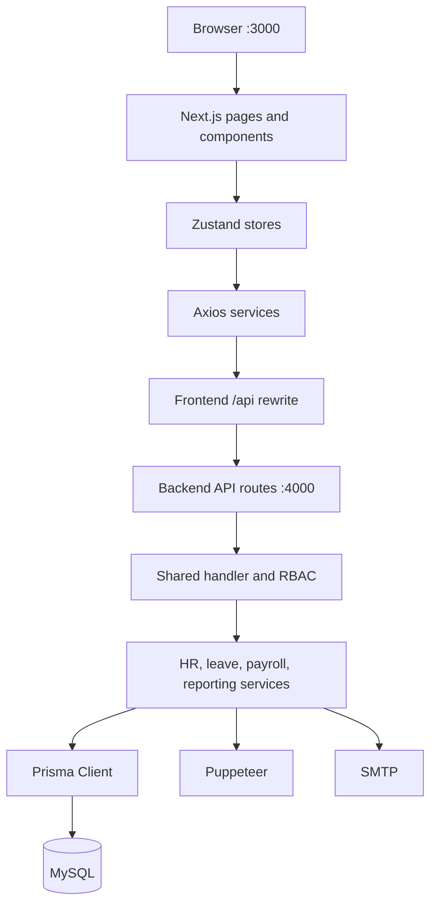
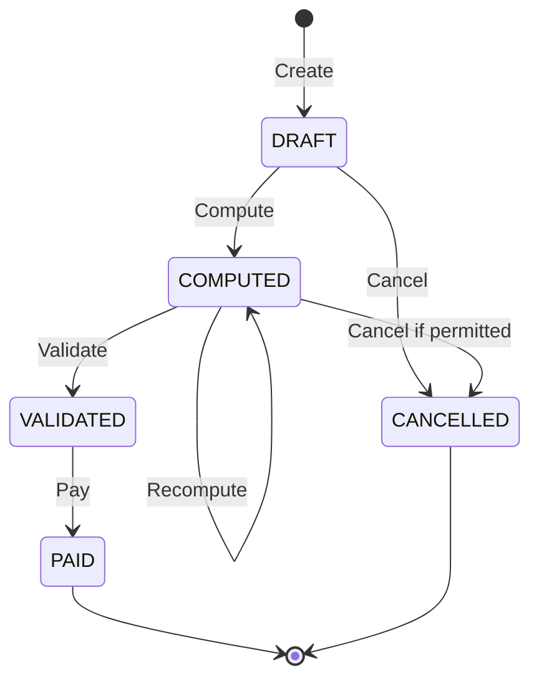

# PeoplePay360

PeoplePay360 is an integrated human-resources and payroll platform. It connects employee records, contracts, working schedules, attendance, leave, configurable salary rules, payruns, payslips, notifications, reporting, PDF generation, and email delivery in one auditable workflow.

The repository has three coordinated workspaces:

- **Frontend** — the browser application and user experience.
- **Backend** — the REST API, authorization, business rules, payroll engine, PDF generation, and email delivery.
- **Database** — the authoritative Prisma schema, migrations, and baseline seed.

```text
Employee
+ applicable contract
+ working schedule
+ attendance
+ approved time off
+ sequenced salary rules
= validated payslip
```

## Contents

- [Project status](#project-status)
- [Features](#features)
- [Technology stack](#technology-stack)
- [Architecture](#architecture)
- [Repository structure](#repository-structure)
- [Prerequisites](#prerequisites)
- [Quick start](#quick-start)
- [Manual setup](#manual-setup)
- [Environment variables](#environment-variables)
- [Frontend-backend integration](#frontend-backend-integration)
- [Authentication and roles](#authentication-and-roles)
- [Database](#database)
- [API conventions](#api-conventions)
- [API reference](#api-reference)
- [Business workflows](#business-workflows)
- [Payroll engine](#payroll-engine)
- [PDF and email](#pdf-and-email)
- [Commands](#commands)
- [Testing](#testing)
- [Troubleshooting](#troubleshooting)
- [Security](#security)
- [Production checklist](#production-checklist)
- [Important implementation notes](#important-implementation-notes)

## Project status

PeoplePay360 is an integrated evaluation/demo application. The current repository includes:

- A real Next.js frontend connected through a server-side API rewrite.
- A Next.js/Node.js backend on port `4000`.
- MySQL storage managed by centralized Prisma migrations.
- HTTP-only cookie-based JWT authentication.
- Backend role and employee-ownership authorization.
- Representative demo data for five user roles.
- Unit tests and a live end-to-end workflow test.
- Puppeteer payslip PDFs and Nodemailer SMTP delivery.

See [`INTEGRATION.md`](INTEGRATION.md) for the short demo note. This README is the detailed source for setup and integration.

## Features

### Authentication and administration

- Bcrypt password hashing.
- Signed JWT sessions.
- Session restoration through `/api/auth/me`.
- Role-aware navigation and backend authorization.
- Administrator user and audit views.

### Employees, contracts, and schedules

- Employee List, Kanban, detail, create, update, and archive flows.
- Department, designation, employee type, manager, and schedule assignment.
- Period-specific contracts with wage and salary structure.
- Contract-overlap detection.
- Standard, shift, and flexible working schedules.
- Schedule-day, break, and weekly-hours calculation.

### Attendance and time off

- Schedule-aware attendance and worked-hour calculation.
- Present, late, absent, and exception statuses.
- Audited HR corrections.
- Paid and unpaid leave types.
- Leave allocation and remaining-balance tracking.
- Schedule-derived leave duration.
- Approval/rejection and employee notifications.

### Payroll

- Configurable salary structures and ordered rules.
- Fixed, percentage, and formula-based rules.
- Safe formula parsing without `eval`.
- Eligible-employee resolution by period and structure.
- Specific or all-eligible payrun selection.
- Draft, computed, validated, paid, and cancelled states.
- Optimistic version checks for payrun actions.
- Payroll warnings, snapshots, payslips, PDFs, and email delivery.

### Dashboard

- Live payroll and workforce information from MySQL.
- Period, department, and employee-type filters.
- Salary, attendance, leave, payslip, and warning metrics.

## Technology stack

| Area | Technology | Responsibility |
| --- | --- | --- |
| Frontend | Next.js 16, React 19 | App Router pages, layouts, and rendering |
| Styling | Tailwind CSS 4 | Responsive dark-theme interface |
| State | Zustand | Authentication and domain state |
| Forms | React Hook Form, Zod | Form state and client validation |
| HTTP | Axios | Same-origin `/api` requests |
| Charts | Recharts | Dashboard visualizations |
| Backend | Next.js 16, Node.js | REST route handlers on port 4000 |
| ORM | Prisma 6 | Queries, relations, migrations, and transactions |
| Database | MySQL 8 | Persistent application state |
| Security | `jose`, `bcryptjs` | JWTs and password hashing |
| Documents | Puppeteer | HTML-to-PDF payslips |
| Email | Nodemailer | SMTP delivery |
| Tests | Node test runner | Calculation and workflow verification |

## Architecture



### Request lifecycle

```text
Page/component
  -> Zustand action
  -> frontend service
  -> Axios /api request
  -> frontend Next.js rewrite
  -> backend route
  -> shared handler
  -> JWT and role/ownership checks
  -> validation
  -> domain logic
  -> Prisma transaction/query
  -> MySQL
  -> JSON or PDF response
  -> store update
  -> UI render
```

Backend route files are intentionally thin. Most re-export handlers from `Backend/src/modules/integration`, keeping URL mapping separate from business logic.

## Repository structure

```text
PeoplePay360/
├── Backend/
│   ├── scripts/
│   │   ├── bootstrap-admin.js
│   │   └── seed-demo.js
│   ├── src/
│   │   ├── app/api/                 # API routes
│   │   ├── lib/                     # Auth, Prisma, errors, utilities
│   │   └── modules/integration/     # Integrated business handlers
│   ├── tests/
│   │   ├── calculations.test.js
│   │   └── live-workflow.js
│   ├── .env.example
│   └── package.json
├── Database/
│   ├── prisma/
│   │   ├── migrations/
│   │   ├── schema.prisma            # Authoritative schema
│   │   ├── seed.ts
│   │   └── test-connection.ts
│   ├── src/lib/prisma.ts
│   ├── .env.example
│   └── package.json
├── Frontend/
│   ├── src/
│   │   ├── app/                     # Pages and layouts
│   │   ├── components/              # UI and domain components
│   │   ├── lib/                     # API, permissions, utilities
│   │   ├── services/                # Domain API clients
│   │   ├── store/                   # Zustand stores
│   │   └── types/
│   ├── next.config.js               # /api rewrite
│   └── package.json
├── scripts/start-demo.ps1
├── backend-architecture.html
├── INTEGRATION.md
└── README.md
```

## Prerequisites

- Node.js 20 or a newer compatible LTS release.
- npm.
- MySQL 8.x.
- A runtime that supports headless Chromium for PDF generation.
- Optional SMTP access for email delivery.

Default local ports:

| Service | Port |
| --- | ---: |
| Frontend | `3000` |
| Backend | `4000` |
| Standard MySQL | `3306` |
| Repository-local Windows demo MySQL | `3307` |

## Quick start

### Configured Windows demo machine

If `.local-runtime` and `Backend/.env` are already prepared, run from the repository root:

```powershell
powershell -ExecutionPolicy Bypass -File scripts/start-demo.ps1
```

Open <http://localhost:3000>.

The script starts, when necessary:

1. Repository-local MySQL on port `3307`.
2. Backend on port `4000`.
3. Frontend on port `3000`.

Seed representative accounts and records once:

```powershell
cd Backend
npm run demo:seed
```

The local runtime, environment files, dependencies, build output, generated files, and logs are excluded from Git.

## Manual setup

### 1. Install dependencies

```powershell
cd Database
npm install

cd ../Backend
npm install

cd ../Frontend
npm install
```

### 2. Create MySQL database

```sql
CREATE DATABASE peoplepay360
  CHARACTER SET utf8mb4
  COLLATE utf8mb4_unicode_ci;
```

Use a dedicated MySQL user with access only to this database.

### 3. Configure environments

```powershell
Copy-Item Backend/.env.example Backend/.env
Copy-Item Database/.env.example Database/.env
```

Put the same working `DATABASE_URL` in both files. Set a strong `JWT_SECRET` in `Backend/.env`.

Create `Frontend/.env.local` if the backend URL differs from the default:

```env
BACKEND_API_URL=http://127.0.0.1:4000
```

### 4. Generate Prisma Client

```powershell
cd Backend
npm run db:generate
```

This uses `Database/prisma/schema.prisma` and generates the client used by the backend.

### 5. Apply migrations

```powershell
cd Backend
npm run db:migrate
```

For local schema development:

```powershell
cd Database
npx prisma validate
npx prisma migrate dev --name meaningful_change_name
```

### 6. Seed

Full evaluation demo:

```powershell
cd Backend
npm run demo:seed
```

Baseline database seed:

```powershell
cd Database
npm run db:seed
```

### 7. Start services

Terminal 1:

```powershell
cd Backend
npm run dev
```

Terminal 2:

```powershell
cd Frontend
npm run dev
```

Open <http://localhost:3000>.

## Environment variables

### Backend (`Backend/.env`)

| Variable | Required | Purpose |
| --- | --- | --- |
| `DATABASE_URL` | Yes | MySQL connection string |
| `JWT_SECRET` | Yes | JWT signing secret |
| `JWT_EXPIRES_IN` | No | Token lifetime; default `8h` |
| `APP_URL` | Recommended | Canonical/allowed application origin |
| `COMPANY_NAME` | No | Company name in payroll snapshots/documents |
| `COMPANY_ADDRESS` | No | Company address in payroll context |
| `COMPANY_TAX_ID` | No | Company tax identifier |
| `SMTP_HOST` | For email | SMTP host |
| `SMTP_PORT` | For email | SMTP port; default `587` |
| `SMTP_SECURE` | No | Secure SMTP flag; port 465 is secure automatically |
| `SMTP_USER` | Sometimes | SMTP username |
| `SMTP_PASS` | Sometimes | SMTP password |
| `SMTP_FROM` | For email | Sender address |
| `ADMIN_EMAIL` | Bootstrap only | Bootstrap administrator email |
| `ADMIN_PASSWORD` | Bootstrap only | Optional bootstrap password |

Example: [`Backend/.env.example`](Backend/.env.example).

### Frontend (`Frontend/.env.local`)

| Variable | Required | Default | Purpose |
| --- | --- | --- | --- |
| `BACKEND_API_URL` | No | `http://127.0.0.1:4000` | Server-side destination for `/api/:path*` |

### Database (`Database/.env`)

| Variable | Required | Purpose |
| --- | --- | --- |
| `DATABASE_URL` | Yes | Prisma CLI and seed connection |
| `DEFAULT_ADMIN_EMAIL` | Seed only | Baseline administrator email |
| `DEFAULT_ADMIN_PASSWORD` | Seed only | Baseline administrator password |

Example: [`Database/.env.example`](Database/.env.example).

Never commit real `.env` files or credentials.

## Frontend-backend integration

### Same-origin API design

The Axios client uses relative paths, cookies, and a 60-second timeout:

```js
axios.create({
  baseURL: '',
  withCredentials: true,
  timeout: 60000,
});
```

The browser calls:

```text
http://localhost:3000/api/...
```

`Frontend/next.config.js` rewrites before local frontend routes:

```text
/api/:path* -> BACKEND_API_URL/api/:path*
```

Default destination:

```text
http://127.0.0.1:4000
```

Benefits include one browser-visible origin, HTTP-only cookie support, and no client-side backend URL.

### Cookie flow

```text
1. Browser posts /api/auth/login.
2. Frontend forwards to backend.
3. Backend verifies bcrypt password.
4. Backend signs JWT and sets peoplepay_token.
5. Axios sends the cookie on later /api requests.
6. requireAuth() verifies JWT and reloads the user from MySQL.
```

### Frontend separation

```text
Page/component -> Zustand store -> service -> Axios -> backend
```

- Components render and collect input.
- Stores own loading, retry, mutation, error, and active-record state.
- Services define API requests.
- Backend owns authorization and business rules.
- Payroll math is never authoritative in the browser.

### Serialization

The database uses canonical names while serializers provide UI compatibility:

```text
firstName + lastName -> name
designation          -> jobPosition
status               -> employmentStatus
workingScheduleId    -> scheduleId
salaryStructureId    -> structureId
```

Schedule and rule serializers also normalize times, decimals, categories, and calculation types.

## Authentication and roles

Passwords are hashed with bcrypt. `jose` signs an HS256 JWT containing user ID, role, issue time, and expiration.

The `peoplepay_token` cookie is:

- HTTP-only.
- `SameSite=Lax`.
- Secure in production.
- Scoped to `/`.

Bearer tokens are also accepted for non-browser clients.

### Role groups

| Group | Roles |
| --- | --- |
| HR | `HR_MANAGER`, `HR_PAYROLL_USER`, `HR_PAYROLL_MANAGER`, `ADMIN` |
| Payroll | `HR_PAYROLL_USER`, `HR_PAYROLL_MANAGER`, `ADMIN` |
| Payroll manager | `HR_PAYROLL_MANAGER`, `ADMIN` |

### Permission summary

| Role | Main capabilities |
| --- | --- |
| `EMPLOYEE` | Own profile, schedule, attendance, contracts, leave, notifications, and issued payslips |
| `HR_MANAGER` | Employees, contracts, schedules, attendance, leave types, allocations, and decisions |
| `HR_PAYROLL_USER` | HR access plus payroll lists, eligibility, creation, and computation |
| `HR_PAYROLL_MANAGER` | Payroll-user access plus salary configuration, validation, payment, cancellation, and delivery |
| `ADMIN` | Full access, user management, and audit history |

Frontend permission helpers control visibility only. Backend authorization is authoritative. Employee access is restricted using the user’s linked `employeeId`.

## Demo accounts

After `npm run demo:seed`, all accounts use `password123`:

| Role | Email |
| --- | --- |
| Administrator | `admin@peoplepay360.com` |
| HR Payroll Manager | `payroll_manager@peoplepay360.com` |
| HR Payroll User | `payroll_user@peoplepay360.com` |
| HR Manager | `hr_manager@peoplepay360.com` |
| Employee | `employee@peoplepay360.com` |

Demo credentials are local-only and must be replaced before deployment.

The demo seed creates Ananya Sharma, a weekday schedule, active contract, monthly salary structure, representative rules, and annual/unpaid leave types.

## Database

### Source of truth

The authoritative schema is:

```text
Database/prisma/schema.prisma
```

It generates the backend Prisma client into:

```text
Backend/node_modules/.prisma/client
```

### Models

| Domain | Models |
| --- | --- |
| Identity | `User` |
| Workforce | `Employee`, `WorkingSchedule`, `ScheduleDay`, `Contract` |
| Attendance | `AttendanceRecord` |
| Leave | `TimeOffType`, `TimeOffAllocation`, `TimeOffRequest` |
| Salary configuration | `SalaryStructure`, `SalaryRule` |
| Payroll | `Payrun`, `PayrunEmployee`, `Payslip`, `PayslipLine` |
| Controls/history | `PayrollWarning`, `AuditLog`, `Notification`, `Payment` |

### Key constraints

- Unique user email and employee code.
- Unique user-to-employee link.
- Unique weekday inside a schedule.
- Unique employee inside a payrun.
- Unique payslip per payrun and employee.
- Unique rule code within a salary structure.
- Fixed-precision decimals for money.
- Restrictive deletion for payroll history.
- Employee archival through `isArchived` and `TERMINATED`.

### Migrations

Current migrations:

```text
20260905084331_init_peoplepay360
20260905150000_integration_context
20260906113000_employee_notifications
20260906170000_employee_archival
```

Apply committed migrations:

```powershell
cd Backend
npm run db:migrate
```

Create a development migration:

```powershell
cd Database
npx prisma migrate dev --name meaningful_change_name
```

Commit both `schema.prisma` and the new migration directory.

## API conventions

### Single resource

```json
{
  "data": {
    "id": "resource-id"
  }
}
```

### List

```json
{
  "data": [],
  "total": 0,
  "page": 1,
  "limit": 20
}
```

List limit is capped at `50` by the shared backend helper.

### Validation error

```json
{
  "message": "Check the highlighted fields",
  "code": "VALIDATION_FAILED",
  "fieldErrors": [
    { "field": "email", "message": "Invalid email" }
  ]
}
```

### HTTP statuses

| Status | Meaning |
| ---: | --- |
| `200` | Successful read/action |
| `201` | Created |
| `400` | Invalid request |
| `401` | Unauthenticated |
| `403` | Forbidden |
| `404` | Not found |
| `409` | Duplicate, overlap, state, or version conflict |
| `422` | Business/payroll validation failure |
| `500` | Unexpected backend failure |
| `502` | Frontend cannot reach backend |
| `503` | External service is not configured |

## API reference

Browser clients use the frontend origin, such as `http://localhost:3000/api/employees`. The frontend forwards requests to the backend.

### Authentication and admin

| Method | Endpoint | Access | Purpose |
| --- | --- | --- | --- |
| `POST` | `/api/auth/login` | Public | Authenticate and set cookie |
| `POST` | `/api/auth/logout` | Session | Expire cookie |
| `GET` | `/api/auth/me` | Authenticated | Restore session |
| `POST` | `/api/auth/register` | Admin | Create/link user |
| `GET` | `/api/admin/users` | Admin | List safe user fields |
| `POST` | `/api/admin/users` | Admin | Create user |
| `GET` | `/api/admin/audit` | Admin | Read recent audit history |

### Employees

| Method | Endpoint | Access | Purpose |
| --- | --- | --- | --- |
| `GET` | `/api/employees` | Authenticated; scoped for employee | List/filter employees |
| `POST` | `/api/employees` | HR | Create employee |
| `GET` | `/api/employees/:id` | HR or owner | Read profile |
| `PUT` | `/api/employees/:id` | HR | Update employee |
| `DELETE` | `/api/employees/:id` | HR | Archive/terminate while preserving history |
| `GET` | `/api/employees/:id/contracts` | HR or owner | Employee contracts |
| `GET` | `/api/employees/:id/attendance` | HR or owner | Employee attendance |
| `GET` | `/api/employees/:id/timeoff` | HR or owner | Employee leave requests |
| `GET` | `/api/employees/:id/allocations` | HR or owner | Employee leave balances |

List filters include `page`, `limit`, `search`, `department`, `status`, `managerId`, and `workingScheduleId`.

### Schedules

`/api/schedules` is the frontend-compatible route. `/api/working-schedules` is retained as an alternate/legacy family.

| Method | Endpoint | Access | Purpose |
| --- | --- | --- | --- |
| `GET`, `POST` | `/api/schedules` | Visible list / HR create | List or create schedules |
| `GET`, `PUT`, `DELETE` | `/api/schedules/:id` | Owner/HR as appropriate | Read, update, or delete schedule; `id` may be `me` |
| `GET`, `POST` | `/api/working-schedules` | HR | Alternate list/create |
| `GET`, `PUT`, `DELETE` | `/api/working-schedules/:id` | HR | Alternate detail/mutation |

### Contracts and attendance

| Method | Endpoint | Access | Purpose |
| --- | --- | --- | --- |
| `GET`, `POST` | `/api/contracts` | Scoped read / HR create | List or create contracts |
| `GET`, `PUT`, `DELETE` | `/api/contracts/:id` | Owner/HR as appropriate | Contract detail/mutation |
| `GET` | `/api/contract-options` | HR | Active structure options without rule detail |
| `GET`, `POST` | `/api/attendance` | Scoped | List or create attendance |
| `PUT`, `DELETE` | `/api/attendance/:id` | HR | Correct or delete attendance |

Attendance filters include `employeeId`, `status`, `fromDate`, `toDate`, `page`, and `limit`.

### Time off

| Method | Endpoint | Access | Purpose |
| --- | --- | --- | --- |
| `GET`, `POST` | `/api/timeoff/types` | Authenticated read / HR create | Leave types |
| `PUT`, `DELETE` | `/api/timeoff/types/:id` | HR | Update/delete unused type |
| `GET`, `POST` | `/api/timeoff/allocations` | Scoped read / HR create | Leave balances |
| `PUT` | `/api/timeoff/allocations/:id` | HR | Update allocation |
| `GET`, `POST` | `/api/timeoff/requests` | Scoped | List/submit requests |
| `PUT` | `/api/timeoff/requests/:id` | HR | Approve/reject request |

Request duration is calculated from the employee schedule rather than trusted from the browser.

### Salary structures and rules

| Method | Endpoint | Access | Purpose |
| --- | --- | --- | --- |
| `GET`, `POST` | `/api/salary-structures` | Payroll read / manager create | Structures and rules |
| `GET`, `PUT`, `DELETE` | `/api/salary-structures/:id` | Payroll/manager | Detail, update, archive |
| `POST` | `/api/salary-structures/preview` | Payroll manager | Preview using real engine |
| `GET`, `POST` | `/api/salary-rules` | Payroll read / manager create | Rule list/create |
| `PUT`, `DELETE` | `/api/salary-rules/:id` | Payroll manager | Update/archive rule |

Calculation types: `FIXED`, `PERCENTAGE`, `FORMULA`.

Categories: `BASIC`, `ALLOWANCE`, `GROSS`, `DEDUCTION`, `NET`, `REIMBURSEMENT`.

### Payruns

| Method | Endpoint | Access | Purpose |
| --- | --- | --- | --- |
| `GET`, `POST` | `/api/payruns` | Payroll | List/create payruns |
| `GET` | `/api/payruns/:id` | Payroll | Detailed payrun |
| `GET` | `/api/payruns/eligible-employees` | Payroll | Resolve eligible employees |
| `POST` | `/api/payruns/:id/compute` | Payroll | Compute/recompute |
| `POST` | `/api/payruns/:id/validate` | Payroll manager | Validate computed payrun |
| `POST` | `/api/payruns/:id/pay` | Payroll manager | Mark validated payrun paid |
| `POST` | `/api/payruns/:id/mark-paid` | Payroll manager | Payment compatibility alias |
| `POST` | `/api/payruns/:id/cancel` | Payroll manager | Cancel when permitted |
| `POST` | `/api/payruns/:id/send-payslips` | Payroll manager | Bulk-send paid payslips |

Filters include `page`, `limit`, `status`, and `search`. Eligibility uses period, salary structure, department, and employee type. State-changing actions use `expectedVersion` where required.

### Payslips, dashboard, and notifications

| Method | Endpoint | Access | Purpose |
| --- | --- | --- | --- |
| `GET` | `/api/payslips` | Payroll or scoped employee | List visible payslips |
| `GET` | `/api/payslips/me` | Employee | Current employee payslips |
| `GET` | `/api/payslips/:id` | Payroll or owner | Detailed payslip |
| `GET` | `/api/payslips/:id/pdf` | Payroll or owner | Download PDF |
| `POST` | `/api/payslips/:id/email` | Payroll manager | Email one paid payslip |
| `GET` | `/api/dashboard` | Payroll | Live dashboard |
| `GET` | `/api/dashboard/payroll` | Payroll | Dashboard alias |
| `GET` | `/api/notifications` | Authenticated | Current user notifications |
| `PUT` | `/api/notifications/:id` | Owner | Update notification state |

Dashboard filters include `period=YYYY-MM`, `department`, and `employeeType`.

## Business workflows

### Employee onboarding

```text
1. HR creates employee.
2. HR assigns manager and schedule.
3. HR creates period-valid contract.
4. Contract assigns wage and salary structure.
5. Admin creates and links login when needed.
6. HR records attendance and leave allocations.
7. Employee becomes payroll-eligible when required data is valid.
```

### Employee removal

Removal preserves history:

1. Direct reports are detached.
2. Linked user account is removed.
3. Employee becomes `TERMINATED` and archived.
4. Contract, attendance, leave, payslip, and audit history remains.

### Time-off approval

```text
1. HR defines leave type and allocation.
2. Employee submits dates and reason.
3. Backend derives duration from schedule.
4. HR approves or rejects pending request.
5. Approval consumes allocation transactionally.
6. Employee receives notification.
7. Payroll-integrated leave enters payroll context.
```

### Payroll lifecycle



Create resolves eligibility, contract, schedule, and salary-structure compatibility. Compute loads attendance and leave, executes rules, creates payslips/lines, saves snapshots, and increments version. Validate reviews warnings and data. Pay finalizes the payrun and payslips atomically. Delivery selects paid payslips and returns per-recipient results.

## Payroll engine

### Contract selection

```text
contract.startDate <= payrun.periodEnd
and
contract.endDate is null or contract.endDate >= payrun.periodStart
```

Exactly one contract must apply. Historical `ENDED` contracts can validly cover historical pay periods.

### Context

Calculation inputs include:

```text
wage, workingDays, workedDays, paidLeaveDays, unpaidLeaveDays,
lossOfPayDays, payableDays, overtimeHours
```

The payslip snapshot captures employee, company, contract, schedule, attendance, and leave context for traceability.

### Rules

Rules execute by ascending sequence:

```text
FIXED      -> configured value
PERCENTAGE -> base value × percentage / 100
FORMULA    -> safely parsed arithmetic expression
```

The formula engine supports known variables, numbers, parentheses, unary signs, and `+ - * /`. It rejects unknown variables, unsupported tokens, duplicate sequences, division by zero, invalid results, and JavaScript execution.

Aggregate `GROSS` and `NET` rules are separated from components to avoid double-counting. Conceptually:

```text
Gross earnings = earning components
Gross deductions = deduction components
Net pay = gross earnings - gross deductions
Net transfer = net pay + reimbursements
```

## PDF and email

Puppeteer loads the authoritative payslip, renders HTML, produces A4 PDF, and responds with `application/pdf`, an attachment filename, and private/no-store caching.

Enable SMTP in `Backend/.env`:

```env
SMTP_HOST=smtp.example.com
SMTP_PORT=587
SMTP_SECURE=false
SMTP_USER=your-user
SMTP_PASS=your-password
SMTP_FROM=PeoplePay360 <no-reply@example.com>
```

If SMTP is absent, the backend returns a configuration error rather than false success.

- Individual: `POST /api/payslips/:id/email`
- Bulk: `POST /api/payruns/:id/send-payslips`

Bulk delivery processes only paid payslips, continues after an individual failure, records successful `emailedAt` values, and returns per-recipient status.

## Commands

### Frontend

| Command | Purpose |
| --- | --- |
| `npm install` | Install dependencies |
| `npm run dev` | Development server on 3000 |
| `npm run build` | Production build |
| `npm run start` | Start production build |
| `npm run lint` | Run configured lint command |

### Backend

| Command | Purpose |
| --- | --- |
| `npm install` | Install dependencies/Puppeteer |
| `npm run dev` | Development server on 4000 |
| `npm run build` | Production build |
| `npm run start` | Start production server on 4000 |
| `npm run db:generate` | Generate client from centralized schema |
| `npm run db:migrate` | Deploy centralized migrations |
| `npm run demo:seed` | Seed complete demo |
| `npm test` | Run backend unit tests |

### Database

| Command | Purpose |
| --- | --- |
| `npm install` | Install Prisma/TypeScript dependencies |
| `npx prisma validate` | Validate schema |
| `npx prisma generate` | Generate configured client |
| `npx prisma migrate dev --name <name>` | Create development migration |
| `npx prisma migrate status` | Check migration status |
| `npm run db:seed` | Baseline seed |
| `npx tsx prisma/test-connection.ts` | Test connection and counts |

## Testing

Backend unit tests:

```powershell
cd Backend
npm test
```

Database verification:

```powershell
cd Database
npx prisma validate
npx prisma migrate status
npx tsx prisma/test-connection.ts
```

Build verification:

```powershell
cd Backend
npm run build

cd ../Frontend
npm run build
```

Live workflow after starting and seeding all services:

```powershell
cd Backend
node --env-file=.env tests/live-workflow.js
```

Optional URL override:

```powershell
$env:TEST_APP_URL='http://localhost:3000'
node --env-file=.env tests/live-workflow.js
```

Unit coverage includes salary totals, reimbursement separation, formula safety, unknown variables, division by zero, unary arithmetic, duplicate rules/sequences, historical contracts, overlaps, and schedule-derived working days.

Recommended manual smoke test:

1. Log in as Admin and verify users/audits.
2. Log in as HR and manage employee, schedule, contract, attendance, allocation, and leave approval.
3. Log in as Payroll Manager and preview structure, create payrun, compute, validate, and pay.
4. Log in as Employee and verify notifications and owned paid payslip.
5. Download PDF and test email after SMTP configuration.

## Troubleshooting

### HTTP 502 or backend unavailable

1. Confirm backend is on port `4000`.
2. Confirm `BACKEND_API_URL` if using another address.
3. Restart frontend after environment/config changes.
4. Visit `http://localhost:4000/api/auth/me`; a JSON `401` proves the backend is reachable.

### Database connection failure

1. Confirm MySQL is running.
2. Verify host, port, database, user, and password in `DATABASE_URL`.
3. URL-encode special password characters.
4. Run `npx tsx prisma/test-connection.ts` inside `Database`.
5. Run `npx prisma migrate status`.

### Prisma Client missing/outdated

```powershell
cd Backend
npm install
npm run db:generate
```

Restart backend afterward.

### Login returns 401

- Run `npm run demo:seed` for demo accounts.
- Confirm the frontend uses `/api/auth/login`.
- Confirm cookies are enabled.
- Keep the same `JWT_SECRET` between login and later requests.
- Clear `peoplepay_token` after changing the secret.

### Request returns 403

Authentication succeeded but role or ownership failed. Check the user's role, linked `employeeId`, endpoint role group, and requested employee/payslip owner.

### PDF failure

- Complete `npm install` in Backend.
- Ensure headless Chromium is supported.
- Verify payslip existence/ownership/status.

### SMTP error

Set `SMTP_HOST` and `SMTP_FROM`; add `SMTP_USER` and `SMTP_PASS` when authentication is required. Port 465 normally uses `SMTP_SECURE=true`.

### Port conflict

Check ports `3000`, `4000`, and MySQL. After changing backend port, update `BACKEND_API_URL` and restart frontend.

### Migration problem

Do not manually edit migration locks or mark migrations complete without reviewing database state. Back up valuable data and run `npx prisma migrate status` from `Database`.

## Security

- Never commit `.env`, `.env.local`, `.local-runtime`, credentials, database dumps, or generated login files.
- Replace development fallback secrets in every deployment.
- Rotate all demo passwords.
- Use least-privilege MySQL credentials.
- Use HTTPS in production.
- Keep cookies HTTP-only and secure.
- Enforce roles and ownership in backend code.
- Never return password hashes or log tokens/passwords.
- Treat bank, PAN, UAN, PF, ESI, attendance, and payroll data as sensitive.
- Never replace the restricted formula engine with `eval` or `new Function`.
- Escape employee-controlled content in documents/messages.
- Preserve audit and paid-payroll history.
- Add production rate limiting, monitoring, backups, and managed secrets.

## Production checklist

- [ ] Strong `JWT_SECRET` configured.
- [ ] Demo passwords removed or rotated.
- [ ] Production MySQL and least-privilege user configured.
- [ ] Committed migrations deployed.
- [ ] Prisma Client generated during build.
- [ ] Production `BACKEND_API_URL` set.
- [ ] Application origins reviewed.
- [ ] HTTPS and secure-cookie behavior verified.
- [ ] SMTP and sender-domain authentication verified.
- [ ] Puppeteer supported by backend runtime.
- [ ] Backend tests pass.
- [ ] Frontend and backend builds pass.
- [ ] All five role boundaries tested.
- [ ] Employee ownership tested.
- [ ] Payrun version conflicts tested.
- [ ] Compute, validate, pay, PDF, and email tested.
- [ ] Logging, monitoring, backup, and restore plans configured.
- [ ] Personal-data retention/access policies reviewed.

## Important implementation notes

### Centralized Prisma schema

The integrated source of truth is `Database/prisma/schema.prisma`. Older backend-local Prisma artifacts remain under `Backend/prisma`; do not treat them as authoritative.

Prefer:

```powershell
cd Backend
npm run db:generate
npm run db:migrate
npm run demo:seed
```

Review any backend database script that does not explicitly use `../Database/prisma/schema.prisma` before running it against important data.

### Integrated backend modules

- `http.js`: auth, roles, errors, pagination, scope, and auditing.
- `hr.js`: employees, contracts, and schedules.
- `operations.js`: attendance and time off.
- `structures.js`: salary structures and preview.
- `payroll.js`: eligibility, payruns, payslips, and state actions.
- `documents.js`: PDF and email.
- `reporting.js`: dashboard, users, and audits.
- `notifications.js`: employee notifications.
- `serializers.js`: database-to-frontend contracts.
- `calculations.js`: formulas, rules, contracts, and working dates.

### Compatibility routes

The frontend uses `/api/schedules`; `/api/working-schedules` remains available. Payment exposes `/pay` and `/mark-paid`. New frontend code should use the established frontend service contracts unless a compatibility change is deliberate.

### Financial integrity

- Keep calculations deterministic and transactional.
- Do not silently recalculate paid payslips.
- Preserve calculation snapshots and audits.
- Select contracts by effective period, including valid historical contracts.
- Do not double-count aggregate salary rules.
- Preserve payroll history when employees are removed.

## Guiding principle

PeoplePay360 is successful when an authorized upstream change to an employee, contract, schedule, attendance, leave, or salary rule produces the correct downstream payroll result while preserving security, history, and accountability.
